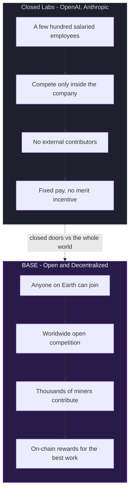
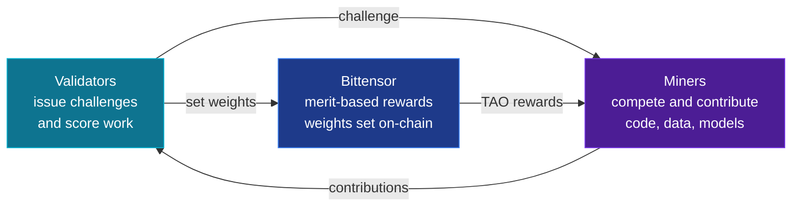
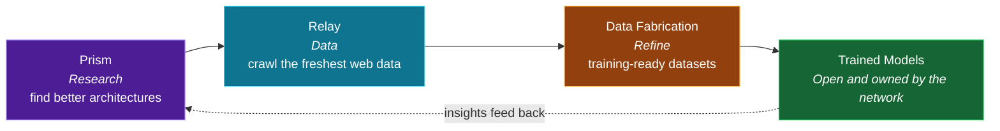

# BASE

### Decentralized Intelligence. Open by design.

**A community-owned alternative to OpenAI and Anthropic, built on Bittensor.**

---

## What is Base

**Base is a Bittensor subnet building frontier AI in the open.** Where OpenAI and Anthropic build behind closed doors, Base turns model research, data collection, and training into a set of open, competitive **challenges** run across a decentralized network of miners.

Every hard problem in the AI pipeline, from discovering better architectures to gathering the freshest training data, is framed as a challenge. Miners around the world compete to solve it, contribute real, working code, and are **incentivized** on-chain for the quality of their work. Validators score contributions and reward the best, so the network improves continuously without a single company owning the outcome.

The result is a lab without walls: the same ambition as the big closed labs, but transparent, permissionless, and owned by its contributors.

---

## Why Base, not a closed lab

The core difference: closed labs are limited to a **handful of salaried employees** competing internally, with no external pressure and no merit-based upside. Base opens the same research to the **entire world** and rewards every contribution on-chain, so the best ideas can come from anyone, anywhere.

| | Closed labs (OpenAI, Anthropic) | **Base** |
|---|---|---|
| **Who competes** | Only internal employees | The whole world, permissionlessly |
| **Talent pool** | A few hundred hires | Thousands of miners, globally |
| **Incentives** | Fixed salaries, no merit reward | On-chain rewards for the best work |
| **Ownership** | Corporate, centralized | Community-owned |
| **Data** | Proprietary pipelines | Decentralized, continuously crawled |
| **Transparency** | Black box | Every contribution is public code |

Base is not one model. It is the **machinery that produces models**, opened up to everyone.

---

## The Challenges

Base coordinates the full AI research loop through specialized challenges. Each one targets a distinct part of building better models:

### Prism - Research
Decentralized neural architecture search. Miners submit architectures and training recipes to discover scalable AI improvements, evaluated competitively so the strongest ideas rise to the top.
> The research engine of Base: how we find *better ways to build models*.

### Relay - Data at the edge of the web
Miners compete to crawl the web on demand, following links and extracting page content, incentivized to relay accurate, up-to-date data whenever it's requested.
> The freshness engine: **recent, real-world data** flowing straight into training.

### Data Fabrication - Training-ready datasets
Developers are incentivized to create diverse, high-performance datasets, evaluated in isolated environments and rewarded on quality and utility.
> The refinement engine: turning raw crawled data into **clean fuel for training**.

### Agent Challenge - Applied intelligence
A platform challenge where developers run and monetize terminal-based AI agents, evaluated in isolated environments and rewarded through competitive performance.

### Bounty Challenge - Continuous improvement
Community-driven bug discovery and software improvement, with rewards based on impact and quality.

---

## How it works

1. **A challenge is issued** - research, crawl, dataset, or agent task.
2. **Miners compete** - they contribute real code, crawled data, or model improvements.
3. **Validators score** - quality is measured in isolated, verifiable environments.
4. **The network rewards** - the best work earns on-chain incentives, and the whole system gets smarter.

---

## The pipeline, end to end

**Prism** discovers *how* to build better models, **Relay** crawls the web for the *most recent* data, **Data Fabrication** turns it into training-ready datasets, and the network trains and improves, in the open.

Research, data, and training, decentralized and incentivized, competing head-to-head with the closed labs.

---

## Get involved

**[Documentation](https://github.com/BaseIntelligence/docs)** · **[Core Subnet](https://github.com/BaseIntelligence/base)** · **[Prism](https://github.com/BaseIntelligence/prism)** · **[Relay](https://github.com/BaseIntelligence/relay)**

*Frontier AI shouldn't be owned by a few. Base is building it for everyone.*

